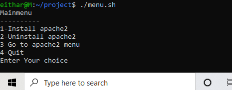
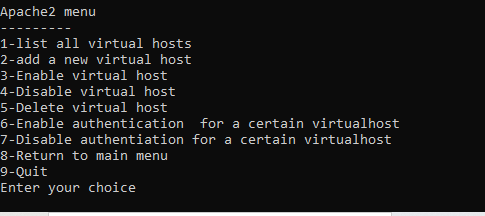

# Bash Project
* [Introduction](#introduction)
* [Tools](#tools)
* [walk-throw](#walk-throw)
* [Screenshots](#screenshots)

## Introduction
shell script that manages apache web server
- Install / remove web server
- Administrate virtualhost /etc/apache2/sites-enabled
	- list all virtual hosts, add, delete, disable, enable
- Configure authentiation for each virtualhost in .htaccess
	- enable auth for a certain virtualhost
	- disable auth for a certain virtualhost
## ToolsI
- bash script
- command line

## Walk-Throw
First you have to run ./menu.sh in order to display main menu which contains:

1 - Install apache2
2- Uninstall apache2
3- Go to apache2 menu
4-Quit
and you have to enter your choice after displaying the menu
if you enter 4 you will be exit the menu, and if you choose 3 the apache2 menu will displayed which contains:

1-list all virtual hosts
2-add a new virtual host
3-Enable virtual host
4-Disable virtual host
5-Delete virtual host
6-Enable authentication  for a certain virtualhost
7-Disable authentiation for a certain virtualhost
8-Return to main menu
9-Quit

## Screenshots:

Main menu:

Apache2 menu:

